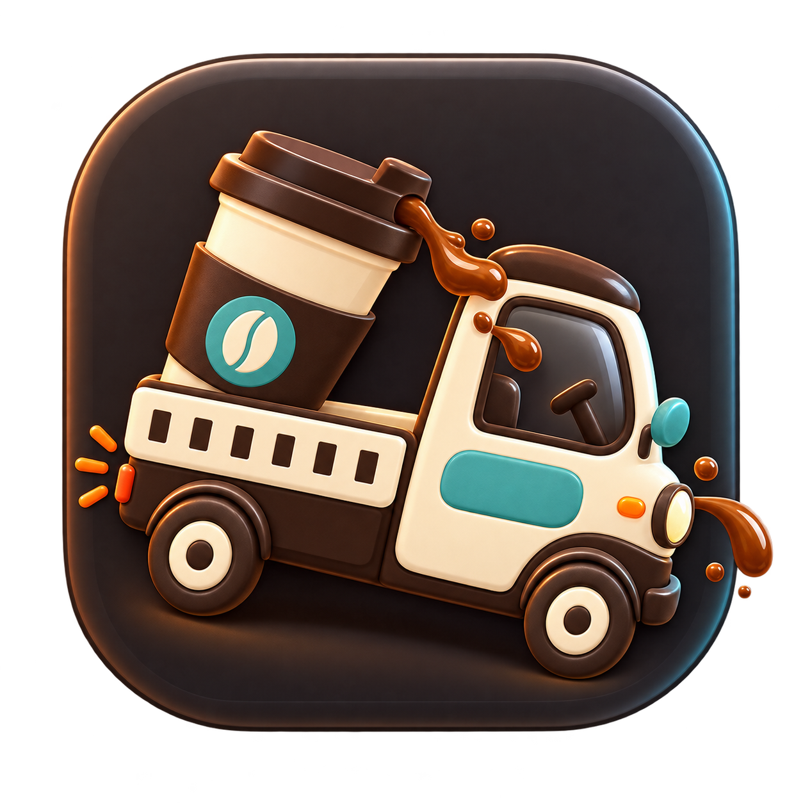
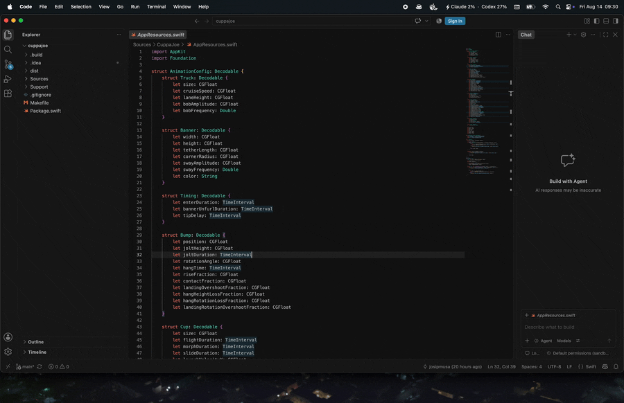

<p align="center">
  
</p>

<h1 align="center">Beanvan</h1>

Beanvan is a native macOS menu-bar app that helps nearby teammates coordinate coffee breaks. It discovers teammates on the local network, keeps a shared weekly schedule in sync, and lets anyone propose an impromptu coffee run.



## Install

Beanvan requires macOS 14 or newer on Apple Silicon.

```sh
brew install --cask josipmusa/tap/beanvan
open -a Beanvan
```

Beanvan is not currently notarized. If macOS blocks it, try opening Beanvan once, then go to **System Settings > Privacy & Security** and choose **Open Anyway**. Alternatively, remove only the quarantine attribute and open Beanvan:

```sh
xattr -dr com.apple.quarantine /Applications/Beanvan.app
open /Applications/Beanvan.app
```

## Use without Homebrew

Download the latest `Beanvan-*-macos-arm64.zip` from [GitHub Releases](https://github.com/josipmusa/beanvan/releases/latest), unzip it, and move `Beanvan.app` to `/Applications`. Open it from there.

The same macOS security prompt described above may appear.

## Usage

Launch Beanvan and click the truck in the menu bar. Choose a display name and a shared team phrase in **Settings**. Teammates using the same phrase on the same local network will discover one another automatically.

Use the schedule editor to choose recurring coffee times and weekdays. Changes synchronize across the team. For an unscheduled break, select **Propose coffee now**. The animation runs for participants when the proposal reaches the configured quorum.

Teammates receive a native macOS notification when a new proposal arrives, in addition to the indicator on the menu-bar truck. Proposal notifications can be turned off in **Settings**.

Beanvan can launch automatically when you log in, skip scheduled breaks for the day, and avoid interrupting full-screen apps or supported meeting apps. These preferences apply only to your Mac and can be changed in **Settings**.

## Security and privacy

The team phrase authenticates peer messages but does not encrypt local-network traffic. Use a non-empty, hard-to-guess phrase for your team. The empty phrase uses a public default key and is intended only for testing.

Beanvan has no analytics, telemetry, third-party backend, or third-party code dependencies. Schedule and preference data stay on your Mac, and peer traffic stays on the local network.


## License

[MIT](LICENSE)
